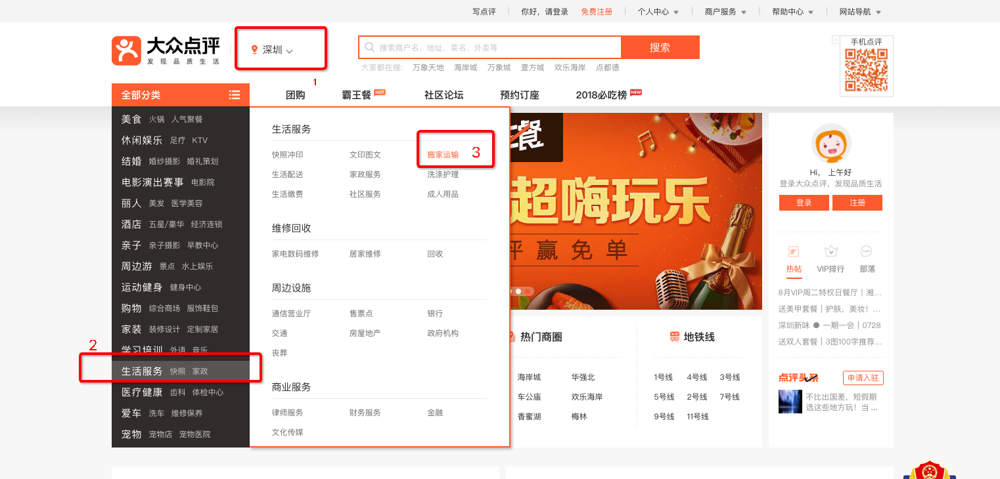
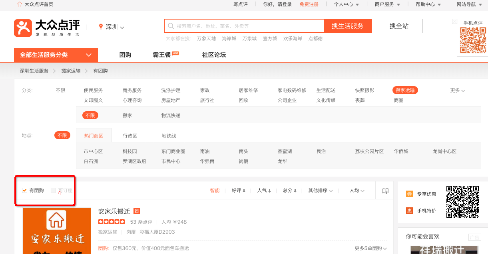

# 准备

- php环境（版本>=7.0）,mac下搭建php环境可[参考](https://getgrav.org/blog/macos-mojave-apache-multiple-php-versions)
- 将项目放置web服务器可供访问
- composer install依赖包


# 文件说明

主要是controllers文件夹下几个文件

- Csvexport.php 公共方法

- DaojiaController.php            58到家网页分析抓取文件
- DianpingController.php       大众点评网页分析抓取文件   
- MeituanController.php        美团网页分析抓取文件


# 实现原理

模拟人访问网页版，分析目标页面数据来源，curl下载网页（每次请求随机用户代理、随机cookie等策略），使用queryList库抓取页面内容得到数据，组装数据保存到csv文件


# 大众点评详细数据来源解析：

访问网页[官网](http://www.dianping.com/)，筛选地区，品类



点击团购，继续筛选



可以得到一些店铺列表，店铺里有团购列表，我们需要的数据是店铺里的团购列表，分析网络请求，并没有可参考的ajax请求，店铺列表是通过后台直接渲染的，点击某个店铺的团购信息，分析网络请求，发现请求http://t.dianping.com/ajax/getaids?ids=30961671&needDeal=1这个接口得到团购信息

总结：需求格式：二级品类,城市,店铺名,团购标题,价格,已售的列表,

先访问店铺列表，得到店铺和附属团购列表，调用接口得到团购详情

数据结构参考

```json
[
      0 => (object)[
          'company' => 'xxx',
          'list' => [
               0 => (object)[
                   'title' => 'subxxxx',
                   'price' => 12,
                   'sellnum' => 4
               ]
    ]
   
]
```


### 链接规则

http://www.dianping.com/城市拼音/一级品类/二级品类p页码m3，

例如http://www.dianping.com/hangzhou/ch80/g33762p1m3

就是获取杭州生活服务、洗涤护理有团购、第1页


### 触发条件

浏览器直接请求路由，经测试无法循环访问得到，只能一页一页的获取，页码累加，重定向访问，直到没数据为止


### 抓取示例

要得到深圳搬家运输有团购的数据

浏览器访问得到链接http://www.dianping.com/shenzhen/ch80/g33986m3

手动修改变量$type、$$cityname、$cityurl的值，浏览器访问自己的虚拟主机地址，例如http://simplecclaw.test/index.php?page=1&r=dianping/index

程序开始爬取数据并保存到项目/web/大众点评.csv文件


流程总结:

浏览器得到链接->修改变量->浏览器访问程序（直到页面显示success），要想爬其他城市的其他品类，修改变量，修改url的page值为1继续访问


**有被网站屏蔽不能访问的情况，改用手机网络请求可解决**


# 美团、58到家思路类似，分析数据渲染结构

美团的数据在页面的script标签里面，有时候访问403需要更改一下cookie请求

58到家的最简单，数据直接获取列表就可以得到

